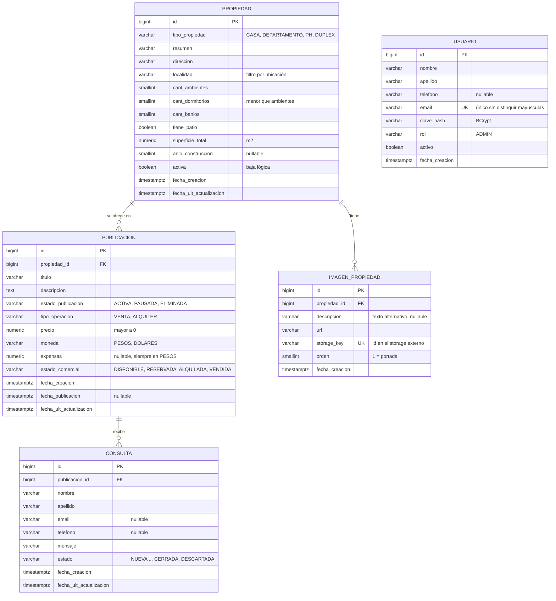
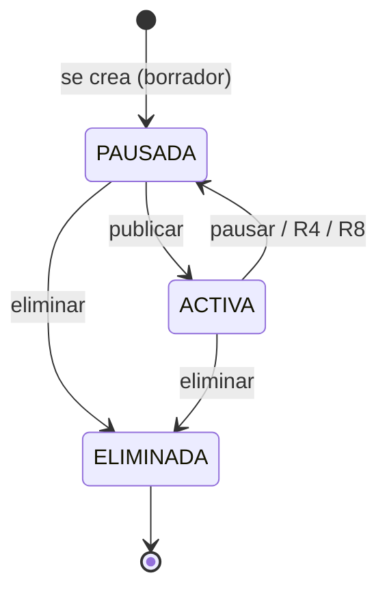
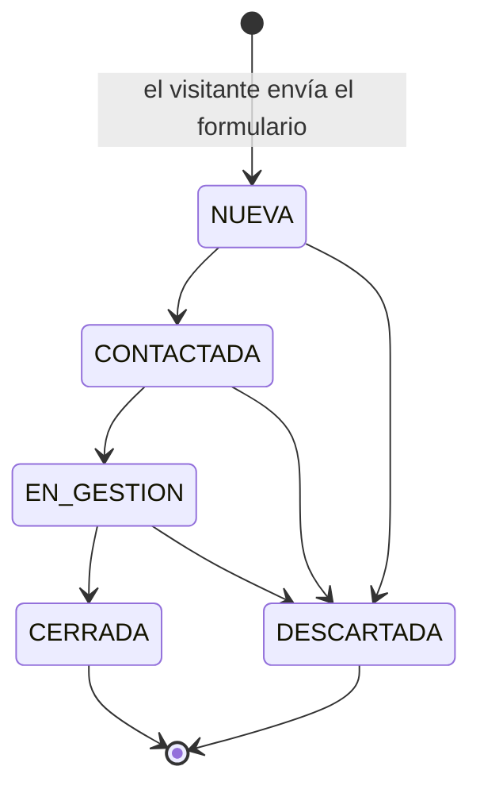

# 1. Modelo de datos

Base de datos **relacional (PostgreSQL)**. Se eligió un modelo relacional porque el dominio es transaccional y con relaciones claras (una propiedad tiene publicaciones, una publicación recibe consultas) y porque la prioridad es la **consistencia**: una propiedad vendida no puede seguir apareciendo como disponible, que es justamente uno de los problemas que el sistema viene a resolver. El volumen esperado (una inmobiliaria chica o mediana: cientos de propiedades, no millones) no justifica desnormalizar.

- Script DDL: [`/database/migrations/V1__esquema_inicial.sql`](../../database/migrations/V1__esquema_inicial.sql)
- Datos de prueba (DML): [`/database/seeds/datos_demo.sql`](../../database/seeds/datos_demo.sql)
- Pruebas de las reglas: [`/database/tests/pruebas_reglas.sql`](../../database/tests/pruebas_reglas.sql)

## 1.1 Diagrama entidad-relación

**Cardinalidades:**

| Relación | Cardinalidad | Lectura |
|---|---|---|
| Propiedad → Publicación | 1 : 0..N | Una propiedad puede no estar publicada todavía, o tener varias publicaciones (venta y alquiler a la vez, o publicaciones viejas como historial). Cada publicación es de exactamente una propiedad. |
| Propiedad → Imagen | 1 : 0..N | Una propiedad puede cargarse sin fotos y agregarlas después. Cada foto pertenece a una sola propiedad. |
| Publicación → Consulta | 1 : 0..N | Una publicación puede no recibir consultas. Cada consulta es sobre una publicación concreta. |
| Usuario | sin relaciones | Ver decisión D6. |

## 1.2 Enumeraciones

| Enum | Valores | Dónde se usa |
|---|---|---|
| `Rol` | `ADMIN` | usuario.rol |
| `TipoPropiedad` | `CASA`, `DEPARTAMENTO`, `PH`, `DUPLEX` | propiedad.tipo_propiedad |
| `TipoOperacion` | `VENTA`, `ALQUILER` | publicacion.tipo_operacion |
| `Moneda` | `PESOS`, `DOLARES` | publicacion.moneda |
| `EstadoPublicacion` | `ACTIVA`, `PAUSADA`, `ELIMINADA` | publicacion.estado_publicacion |
| `EstadoComercial` | `DISPONIBLE`, `RESERVADA`, `ALQUILADA`, `VENDIDA` | publicacion.estado_comercial |
| `EstadoConsulta` | `NUEVA`, `CONTACTADA`, `EN_GESTION`, `CERRADA`, `DESCARTADA` | consulta.estado |

En la base se implementan como `VARCHAR` + `CHECK`, y en Java como `enum` con `@Enumerated(EnumType.STRING)`. No se usa el tipo `ENUM` nativo de PostgreSQL porque agregar un valor después exige `ALTER TYPE` y complica el mapeo con Hibernate.

## 1.3 Reglas de negocio

Cada regla indica **dónde se garantiza**: en la base (no se puede romper aunque haya un bug en el backend) o en la aplicación (la valida el módulo correspondiente).

| # | Regla | Dónde |
|---|---|---|
| R1 | El catálogo público muestra solo publicaciones `ACTIVA`, de propiedades `activa = true` y con estado comercial `DISPONIBLE` o `RESERVADA` (esta última se muestra con una etiqueta "Reservada"). | Consulta del módulo Catálogo |
| R2 | Una propiedad puede tener **como máximo una publicación ACTIVA por tipo de operación** (una de venta y una de alquiler a la vez, pero no dos de venta). | Base: índice único parcial `ux_publicacion_activa_por_operacion` |
| R3 | Una publicación de `ALQUILER` no puede quedar `VENDIDA`, y una de `VENTA` no puede quedar `ALQUILADA`. | Base: `ck_publicacion_estado_vs_operacion` |
| R4 | Cuando una publicación pasa a `VENDIDA`, el sistema pausa automáticamente las demás publicaciones activas de esa propiedad (si se vendió, ya no se puede alquilar). Cuando pasa a `ALQUILADA`, pausa solo esa publicación. | Aplicación: módulo Publicaciones |
| R5 | `ELIMINADA` es un estado final: no se puede reactivar. Para volver a ofrecer la propiedad se crea una publicación nueva. | Aplicación: módulo Publicaciones |
| R6 | La primera vez que una publicación pasa a `ACTIVA` se registra `fecha_publicacion`. Una publicación activa siempre tiene esa fecha. | Base (`ck_publicacion_fecha_publicacion`) + aplicación |
| R7 | Al crear una publicación, la `descripcion` se completa por defecto con el `resumen` de la propiedad; el administrador la puede modificar. | Aplicación: módulo Publicaciones |
| R8 | Dar de baja una propiedad (`activa = false`) pausa todas sus publicaciones activas. No se borra nada físicamente. | Aplicación (evento `PropiedadDadaDeBaja`, ver módulos) + base (`ON DELETE RESTRICT`) |
| R9 | Solo se pueden enviar consultas sobre publicaciones visibles en el catálogo (R1). | Aplicación: módulo Consultas |
| R10 | Una consulta debe tener al menos un medio de contacto (email o teléfono) y un mensaje no vacío. | Base: `ck_consulta_contacto`, `ck_consulta_mensaje` |
| R11 | Las consultas avanzan `NUEVA → CONTACTADA → EN_GESTION → CERRADA`. Desde cualquier estado no final se puede pasar a `DESCARTADA`. `CERRADA` y `DESCARTADA` son finales. Las consultas nunca se borran (trazabilidad). | Aplicación: módulo Consultas |
| R12 | El filtro por rango de precio siempre se aplica **dentro de una moneda** (no se comparan pesos con dólares). | Aplicación: módulo Catálogo |
| R13 | Dos imágenes de la misma propiedad no pueden tener el mismo `orden`. La de orden 1 es la portada. | Base: `ux_imagen_orden_por_propiedad` (diferible, para poder reordenar) |
| R14 | Los dormitorios se cuentan dentro de los ambientes: `cant_dormitorios < cant_ambientes` (un monoambiente tiene 1 ambiente y 0 dormitorios). | Base: `ck_propiedad_dorm_vs_amb` |

### Estados de una publicación

### Estados de una consulta

## 1.4 Decisiones de diseño

**D1. Propiedad y Publicación son entidades separadas.** En la propuesta inicial había una sola entidad `Propiedad` con precio, operación y estado. Al modelar el negocio apareció que una misma casa puede ofrecerse en venta y en alquiler al mismo tiempo, y que una propiedad puede publicarse, retirarse y volver a publicarse con otro precio. Con una sola entidad habría que duplicar el inmueble (y sus fotos) o perder el historial. Separando, el inmueble se carga una vez y cada oferta tiene su propio precio, estado y consultas.

**D2. Las imágenes pertenecen a la Propiedad, no a la Publicación.** Las fotos muestran el inmueble, no la oferta. Si se crea una publicación de alquiler de una casa que ya estaba en venta, reutiliza las mismas fotos.

**D3. Las consultas pertenecen a la Publicación, no a la Propiedad.** Así se sabe si el interesado preguntaba por la venta o por el alquiler, y a qué precio lo vio.

**D4. Se guarda `anio_construccion` en vez de `anios_antiguedad`.** La antigüedad cambia todos los años; si se guarda, queda desactualizada sin que nadie toque el registro. Se guarda el dato que no cambia y la antigüedad se calcula al mostrarla.

**D5. Las expensas son siempre en pesos.** En el mercado argentino es habitual publicar el precio en dólares y las expensas en pesos. Con una sola columna `moneda` el modelo obligaba a que ambos compartan moneda. Se decidió que `expensas` es siempre en pesos (y `NULL` si no tiene, por ejemplo una casa).

**D6. `Usuario` no tiene relaciones en el MVP.** El sistema es para una sola inmobiliaria y el único rol es `ADMIN`: cualquier administrador gestiona todas las propiedades y consultas, así que no hace falta saber "de quién" es cada una. Si más adelante se agregan agentes con cartera propia o auditoría ("quién cambió este precio"), se agregaría una FK `usuario_id` o una tabla de historial.

**D7. La dirección es texto libre, pero la localidad es un campo aparte.** Normalizar direcciones (provincia, localidad, barrio, calle) es mucho trabajo para el MVP. Pero el filtro por ubicación estaba prometido en la HU-01, y no se puede filtrar bien sobre un texto libre. Separar `localidad` resuelve el filtro sin sobrediseñar.

**D8. Los archivos de imagen no se guardan en la base ni en el servidor.** Se guardan en un servicio de almacenamiento externo (ver arquitectura). La base guarda la `url` pública y la `storage_key`, que se usa para borrar el archivo del storage cuando se elimina la foto. Además, el servidor del backend (Render) no tiene disco persistente en el plan gratuito: cualquier archivo guardado ahí se pierde con cada despliegue.

**D9. Todas las bajas son lógicas.** Propiedades, publicaciones y usuarios se desactivan, no se borran. Las FK usan `ON DELETE RESTRICT` para que un borrado físico accidental falle en vez de dejar consultas huérfanas.

**D10. Tipos de propiedad limitados a viviendas.** Terrenos, locales y oficinas quedan fuera del MVP porque sus características son distintas (un terreno no tiene ambientes ni baños; un local tiene frente y vidriera). Incluirlos obligaría a dejar columnas vacías o a modelar herencia. Se documenta como mejora futura.

## 1.5 Diccionario de datos

### usuario

| Columna | Tipo | Nulo | Descripción |
|---|---|---|---|
| id | BIGINT (identity) | No | PK |
| nombre / apellido | VARCHAR(80) | No | |
| telefono | VARCHAR(30) | Sí | |
| email | VARCHAR(120) | No | Único sin distinguir mayúsculas. Es el usuario de login. |
| clave_hash | VARCHAR(100) | No | Hash BCrypt. La contraseña en texto plano nunca se guarda. |
| rol | VARCHAR(20) | No | `ADMIN` |
| activo | BOOLEAN | No | Un usuario inactivo no puede iniciar sesión. |
| fecha_creacion | TIMESTAMPTZ | No | |

### propiedad

| Columna | Tipo | Nulo | Descripción |
|---|---|---|---|
| id | BIGINT (identity) | No | PK |
| tipo_propiedad | VARCHAR(20) | No | Enum `TipoPropiedad` |
| resumen | VARCHAR(500) | No | Descripción corta del inmueble. Base de la descripción de las publicaciones. |
| direccion | VARCHAR(200) | No | Texto libre (calle, número, piso, depto) |
| localidad | VARCHAR(100) | No | Usada por el filtro de ubicación |
| cant_ambientes | SMALLINT | No | ≥ 1 |
| cant_dormitorios | SMALLINT | No | ≥ 0 y menor que ambientes |
| cant_banios | SMALLINT | No | ≥ 1 |
| tiene_patio | BOOLEAN | No | |
| superficie_total | NUMERIC(10,2) | No | m², > 0 |
| anio_construccion | SMALLINT | Sí | ≥ 1800. `NULL` si se desconoce. |
| activa | BOOLEAN | No | Baja lógica |
| fecha_creacion / fecha_ult_actualizacion | TIMESTAMPTZ | No | La actualización la maneja JPA (`@UpdateTimestamp`) |

### publicacion

| Columna | Tipo | Nulo | Descripción |
|---|---|---|---|
| id | BIGINT (identity) | No | PK |
| propiedad_id | BIGINT | No | FK → propiedad |
| titulo | VARCHAR(120) | No | |
| descripcion | TEXT | No | Por defecto, el resumen de la propiedad (R7) |
| estado_publicacion | VARCHAR(20) | No | Enum `EstadoPublicacion`. Se crea `PAUSADA`. |
| tipo_operacion | VARCHAR(20) | No | Enum `TipoOperacion` |
| precio | NUMERIC(14,2) | No | > 0. `NUMERIC` y no `FLOAT` para no perder centavos. |
| moneda | VARCHAR(10) | No | Enum `Moneda` (del precio) |
| expensas | NUMERIC(12,2) | Sí | Siempre en pesos (D5) |
| estado_comercial | VARCHAR(20) | No | Enum `EstadoComercial`. Coherente con la operación (R3). |
| fecha_creacion | TIMESTAMPTZ | No | |
| fecha_publicacion | TIMESTAMPTZ | Sí | Primera vez que pasó a `ACTIVA`. Ordena el catálogo. |
| fecha_ult_actualizacion | TIMESTAMPTZ | No | |

### imagen_propiedad

| Columna | Tipo | Nulo | Descripción |
|---|---|---|---|
| id | BIGINT (identity) | No | PK |
| propiedad_id | BIGINT | No | FK → propiedad |
| descripcion | VARCHAR(200) | Sí | Se usa como texto alternativo (`alt`) para accesibilidad |
| url | VARCHAR(500) | No | URL pública del archivo |
| storage_key | VARCHAR(255) | No | Identificador del archivo en el storage. Único. |
| orden | SMALLINT | No | ≥ 1, único por propiedad. 1 = portada. |
| fecha_creacion | TIMESTAMPTZ | No | |

### consulta

| Columna | Tipo | Nulo | Descripción |
|---|---|---|---|
| id | BIGINT (identity) | No | PK |
| publicacion_id | BIGINT | No | FK → publicacion |
| nombre / apellido | VARCHAR(80) | No | |
| email | VARCHAR(120) | Sí | Al menos uno de email o teléfono (R10) |
| telefono | VARCHAR(30) | Sí | |
| mensaje | VARCHAR(2000) | No | No vacío |
| estado | VARCHAR(20) | No | Enum `EstadoConsulta`. Arranca en `NUEVA`. |
| fecha_creacion / fecha_ult_actualizacion | TIMESTAMPTZ | No | |

## 1.6 Índices

| Índice | Para qué |
|---|---|
| `ux_usuario_email` (único, sobre `lower(email)`) | Login y evitar emails duplicados |
| `ux_publicacion_activa_por_operacion` (único parcial) | Regla R2 |
| `ix_publicacion_catalogo` (parcial, solo ACTIVA) | Filtros de operación, moneda y precio del catálogo |
| `ix_propiedad_tipo`, `ix_propiedad_localidad`, `ix_propiedad_ambientes` | Filtros del catálogo |
| `ix_consulta_bandeja` | Bandeja de consultas del panel, por estado y fecha |
| `ix_publicacion_propiedad`, `ix_consulta_publicacion` | Joins por FK (PostgreSQL no indexa las FK automáticamente) |
