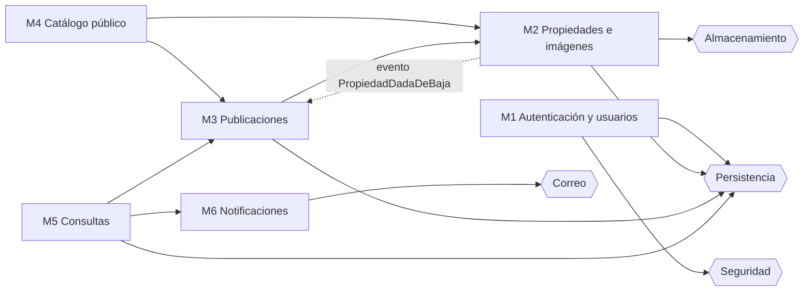

# 2. Módulos del sistema

El sistema se divide en **6 módulos de negocio**, más un conjunto de **componentes de infraestructura** que resuelven detalles técnicos (base de datos, correo, almacenamiento de archivos, seguridad).

El criterio de corte fue el dominio y no la tecnología: cada módulo corresponde a una parte del negocio con reglas propias y una sola razón para cambiar. Por ejemplo, si cambia la forma de enviar correos se toca Notificaciones o la infraestructura de correo, y Consultas no se entera.

## 2.1 Resumen

| # | Módulo | Responsabilidad (una razón para cambiar) | Entidades que administra | Historias de usuario |
|---|---|---|---|---|
| M1 | Autenticación y usuarios | Quién puede entrar al panel y cómo | Usuario | HU-05 |
| M2 | Propiedades e imágenes | Datos del inmueble físico y sus fotos | Propiedad, ImagenPropiedad | HU-03 |
| M3 | Publicaciones | Cómo y cuándo se ofrece un inmueble: precio, operación y estados | Publicación | HU-03 |
| M4 | Catálogo público | Qué ve el visitante: listado, filtros y detalle | Ninguna (solo lectura) | HU-01 |
| M5 | Consultas | Recepción y seguimiento de los interesados | Consulta | HU-02, HU-04 |
| M6 | Notificaciones | Qué se avisa, a quién y con qué contenido | Ninguna | HU-02 |

Cada entidad tiene **un único módulo dueño**, que es el único que la escribe. Los demás módulos que necesitan esos datos se los piden al dueño a través de su API interna.

## 2.2 Detalle por módulo

### M1 — Autenticación y usuarios

**Funcionalidades**
- Inicio de sesión del administrador con email y contraseña. Devuelve un token JWT.
- Protección de todas las rutas del panel (`/api/admin/**` en el backend, rutas privadas en el frontend).
- Activar y desactivar administradores. Un usuario inactivo no puede iniciar sesión.
- Cambio de la propia contraseña.

**Reglas:** las contraseñas se guardan con hash BCrypt; no se puede desactivar al último administrador activo (el sistema quedaría sin acceso).

**API pública (REST)**

| Método | Ruta | Descripción |
|---|---|---|
| POST | `/api/auth/login` | Login. Devuelve JWT. |
| GET | `/api/auth/me` | Datos del admin logueado |
| PUT | `/api/admin/usuarios/me/clave` | Cambiar la propia contraseña |
| GET | `/api/admin/usuarios` | Listar administradores |
| POST | `/api/admin/usuarios` | Crear administrador |
| PATCH | `/api/admin/usuarios/{id}/estado` | Activar / desactivar |

**Depende de:** infraestructura de Seguridad (Spring Security + JWT) y Persistencia.

---

### M2 — Propiedades e imágenes

**Funcionalidades**
- Alta y edición de propiedades con sus características (tipo, ambientes, dormitorios, baños, patio, superficie, año de construcción, dirección y localidad).
- Baja lógica de propiedades. Al darse de baja, publica el evento `PropiedadDadaDeBaja` (regla R8).
- Carga de imágenes al storage externo, eliminación y reordenamiento (la de orden 1 es la portada).

**Reglas:** R13 (orden único), R14 (dormitorios menores que ambientes). Al borrar una imagen también se borra el archivo del storage, usando su `storage_key`.

**API pública (REST)**

| Método | Ruta | Descripción |
|---|---|---|
| GET | `/api/admin/propiedades` | Listar (con filtro por activas/inactivas) |
| POST | `/api/admin/propiedades` | Crear |
| GET | `/api/admin/propiedades/{id}` | Ver detalle |
| PUT | `/api/admin/propiedades/{id}` | Editar |
| PATCH | `/api/admin/propiedades/{id}/baja` | Baja lógica |
| POST | `/api/admin/propiedades/{id}/imagenes` | Subir imagen (multipart) |
| PUT | `/api/admin/propiedades/{id}/imagenes/orden` | Reordenar |
| DELETE | `/api/admin/propiedades/{id}/imagenes/{imagenId}` | Eliminar imagen |

**API interna (lo que otros módulos pueden pedirle)**
- `obtenerResumen(propiedadId)` → datos básicos del inmueble (tipo, localidad, resumen, ¿está activa?).
- `obtenerImagenes(propiedadId)` → lista ordenada de imágenes.

**Depende de:** infraestructura de Almacenamiento de archivos y Persistencia.

---

### M3 — Publicaciones

**Funcionalidades**
- Crear una publicación a partir de una propiedad existente. La descripción se completa con el resumen de la propiedad y es editable (R7).
- Editar título, descripción, precio, moneda y expensas.
- Cambiar el estado de publicación: publicar, pausar, eliminar (baja lógica).
- Cambiar el estado comercial: disponible, reservada, alquilada, vendida.

**Reglas:** R2, R3, R4, R5, R6. Además escucha el evento `PropiedadDadaDeBaja` y pausa las publicaciones activas de esa propiedad (R8).

**API pública (REST)**

| Método | Ruta | Descripción |
|---|---|---|
| GET | `/api/admin/publicaciones` | Listar con filtros por estado |
| POST | `/api/admin/publicaciones` | Crear (recibe `propiedadId`) |
| PUT | `/api/admin/publicaciones/{id}` | Editar datos |
| PATCH | `/api/admin/publicaciones/{id}/estado` | ACTIVA / PAUSADA / ELIMINADA |
| PATCH | `/api/admin/publicaciones/{id}/estado-comercial` | DISPONIBLE / RESERVADA / ALQUILADA / VENDIDA |

**API interna**
- `estaVisibleEnCatalogo(publicacionId)` → `true/false` (aplica R1). La usa Consultas.
- `obtenerResumen(publicacionId)` → título, operación, precio y moneda. La usa Notificaciones para armar el correo.

**Depende de:** M2 (para validar que la propiedad existe y está activa, y para tomar el resumen) y Persistencia.

---

### M4 — Catálogo público

**Funcionalidades**
- Listado paginado de publicaciones visibles (R1), ordenado por las más recientes.
- Filtros: tipo de operación, tipo de propiedad, cantidad mínima de ambientes, localidad y rango de precio dentro de una moneda (R12).
- Vista de detalle: datos de la propiedad, descripción, precio, expensas y galería de imágenes.

**Por qué búsqueda y catálogo son un mismo módulo:** los filtros son parámetros del mismo listado, no una funcionalidad aparte. Separarlos generaría dos módulos que consultan exactamente los mismos datos y cambian siempre juntos (baja cohesión entre ellos, alto acoplamiento).

**Por qué no está dentro de Publicaciones:** el catálogo es la cara pública y de solo lectura; Publicaciones es la gestión privada y con reglas de escritura. Cambian por motivos distintos (un rediseño del catálogo no debería tocar las reglas de estados).

**API pública (REST, sin autenticación)**

| Método | Ruta | Descripción |
|---|---|---|
| GET | `/api/catalogo?operacion=&tipo=&ambientesMin=&localidad=&moneda=&precioMin=&precioMax=&page=` | Listado filtrado |
| GET | `/api/catalogo/{publicacionId}` | Detalle con imágenes |
| GET | `/api/catalogo/localidades` | Localidades con publicaciones activas (para el selector del filtro) |

**Depende de:** M3 y M2 (solo lectura).

---

### M5 — Consultas

**Funcionalidades**
- Formulario público de consulta desde el detalle de una publicación, con validación.
- Registro de la consulta en estado `NUEVA` y aviso a la inmobiliaria.
- Bandeja del panel: listado de consultas filtrado por estado, de la más nueva a la más vieja.
- Cambio de estado de una consulta según el flujo definido (R11).

**Reglas:** R9, R10, R11. Las consultas nunca se borran.

**API pública (REST)**

| Método | Ruta | Descripción |
|---|---|---|
| POST | `/api/catalogo/{publicacionId}/consultas` | Enviar consulta (público) |
| GET | `/api/admin/consultas?estado=` | Bandeja |
| GET | `/api/admin/consultas/{id}` | Detalle |
| PATCH | `/api/admin/consultas/{id}/estado` | Cambiar estado |

**Depende de:** M3 (pregunta `estaVisibleEnCatalogo`), M6 (pide que se notifique) y Persistencia.

**Ejemplo de frontera entre módulos:** Consultas no lee la tabla `publicacion` para decidir si acepta la consulta. Le pregunta a Publicaciones "¿esta publicación está visible?" y recibe `true` o `false`. Si mañana cambia la regla de visibilidad, solo cambia Publicaciones.

---

### M6 — Notificaciones

**Funcionalidades**
- Enviar un correo a la inmobiliaria cuando entra una consulta nueva, con los datos del interesado y un enlace a la consulta en el panel.
- (Opcional) Enviar un correo de confirmación al interesado, si dejó email.

**Por qué es un módulo aparte:** qué se notifica y con qué contenido es una decisión de negocio que cambia por motivos propios (agregar un aviso por WhatsApp, cambiar el texto del correo). Cómo se envía el correo es un detalle técnico que queda en infraestructura.

**Reglas:** si el envío del correo falla, la consulta **igual queda registrada**. El correo se envía después de confirmar la transacción y el error se registra en el log, sin mostrárselo al visitante.

**API interna**
- `notificarNuevaConsulta(consultaId, datosInteresado, resumenPublicacion)`

**Depende de:** infraestructura de Correo.

---

## 2.3 Infraestructura (componentes técnicos)

| Componente | Responsabilidad | Tecnología prevista |
|---|---|---|
| Persistencia | Repositorios y acceso a la base | Spring Data JPA + PostgreSQL, migraciones con Flyway |
| Seguridad | Filtro JWT, hash de contraseñas, CORS | Spring Security, BCrypt |
| Almacenamiento de archivos | Subir, obtener URL y borrar imágenes | Servicio externo (Cloudinary o Supabase Storage), detrás de una interfaz `AlmacenamientoArchivos` |
| Correo | Enviar correos | Proveedor de correo transaccional por API HTTP (Resend o Brevo), detrás de una interfaz `EnvioCorreo` |

Almacenamiento y Correo se usan **a través de interfaces**. Así, cambiar de proveedor implica escribir otra implementación de la interfaz, sin tocar los módulos de negocio. Se prefiere un proveedor de correo con API HTTP en lugar de SMTP porque algunas plataformas gratuitas restringen los puertos SMTP salientes.

## 2.4 Dependencias entre módulos

Las flechas van del módulo que **usa** al módulo **usado**. No hay dependencias circulares: la baja de una propiedad se comunica con un evento (M2 publica, M3 escucha), por lo que M2 no necesita conocer a M3.

La línea punteada es un evento, no una dependencia: M2 avisa que algo pasó y no sabe quién lo escucha.

## 2.5 Trazabilidad con las historias de usuario

| Historia de usuario (entrega 1) | Módulos |
|---|---|
| HU-01 — Filtrar propiedades por operación, tipo, ubicación y precio | M4 |
| HU-02 — Enviar una consulta desde el detalle de una propiedad | M5, M6 |
| HU-03 — Crear, editar, publicar o desactivar propiedades con imágenes | M2, M3 |
| HU-04 — Visualizar y actualizar el estado de las consultas | M5 |
| HU-05 — Autenticarse para acceder al panel | M1 |
