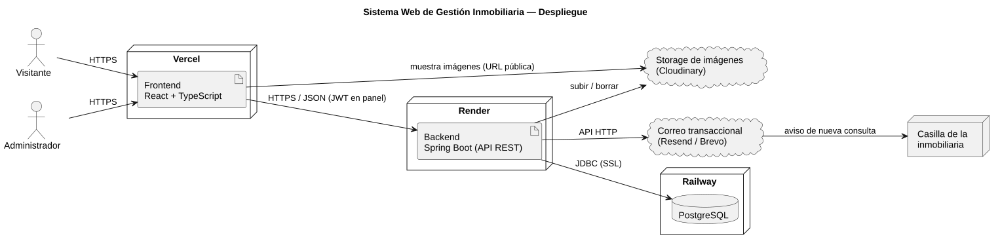
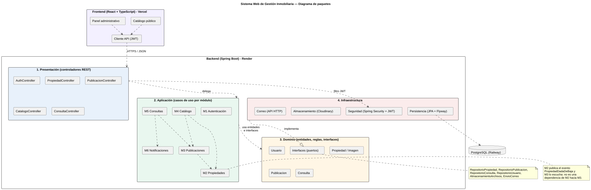

# 3. Arquitectura

## 3.1 Vista general

El sistema es una aplicación web cliente-servidor en tres piezas desplegadas por separado:

- **Frontend** (React + TypeScript, en Vercel). Tiene dos partes: el catálogo público y el panel administrativo. No tiene lógica de negocio; muestra datos y envía acciones a la API.
- **Backend** (Spring Boot, en Render). Expone una API REST y concentra toda la lógica de negocio.
- **Base de datos** (PostgreSQL, en Railway).

Además usa dos servicios externos: un **storage de imágenes** (las fotos no se guardan en el servidor, ver decisión D8 del modelo de datos) y un **proveedor de correo** para las notificaciones.



## 3.2 Arquitectura en capas del backend

El backend se organiza en las cuatro capas vistas en la materia:

| Capa | Responsabilidad | Qué hay en nuestro sistema | Qué NO hace |
|---|---|---|---|
| 1. Presentación | Recibir pedidos HTTP, validar formato, devolver respuestas | Controladores REST, DTOs de entrada y salida, manejo global de errores | No decide nada del negocio |
| 2. Aplicación | Orquestar cada caso de uso: qué se hace y en qué orden | Un servicio por módulo (M1 a M6). Ej.: "registrar consulta" = preguntar a Publicaciones si está visible, guardar, pedir la notificación. | No contiene las reglas en sí |
| 3. Dominio | Reglas de negocio | Entidades (`Propiedad`, `Publicacion`, `Consulta`...) con sus reglas: transiciones de estado válidas, coherencia estado/operación, etc. Interfaces de repositorios, storage y correo. | No sabe nada de HTTP, SQL, Cloudinary ni del proveedor de correo |
| 4. Infraestructura | Detalles técnicos | Repositorios JPA, migraciones Flyway, Spring Security + JWT, cliente de Cloudinary, cliente del proveedor de correo | No decide reglas de negocio |

**Inversión de dependencias en infraestructura.** El dominio declara *qué* necesita (por ejemplo, la interfaz `EnvioCorreo` con un método `enviar(destinatario, asunto, cuerpo)`), y la infraestructura provee *cómo* se hace (la clase que llama a la API del proveedor). Así el dominio no depende de ningún proveedor: cambiar Cloudinary por Supabase Storage, o un proveedor de correo por otro, es escribir una nueva implementación sin tocar los módulos de negocio.



> Fuente de los diagramas: [`diagramas/paquetes.puml`](diagramas/paquetes.puml) y [`diagramas/despliegue.puml`](diagramas/despliegue.puml) (PlantUML). Se eligió PlantUML porque Mermaid no tiene diagrama de paquetes UML y, al ser texto, los diagramas quedan versionados en el repositorio junto con el código.

## 3.3 Organización del código

Para que la estructura de carpetas refleje los módulos, el backend se organiza **por módulo primero y por capa después**. Así, todo lo de Consultas está junto y se ve de un vistazo qué depende de qué.

```
backend/src/main/java/.../inmobiliaria/
├── auth/            M1  (api/ aplicacion/ dominio/ infraestructura/)
├── propiedades/     M2
├── publicaciones/   M3
├── catalogo/        M4
├── consultas/       M5
├── notificaciones/  M6
└── compartido/      configuración, seguridad, manejo de errores, storage y correo

backend/src/main/resources/db/migration/   migraciones Flyway (copiadas de /database/migrations)
```

El frontend sigue el mismo criterio:

```
frontend/src/
├── catalogo/        listado, filtros, detalle, formulario de consulta
├── panel/           login, propiedades, publicaciones, consultas, usuarios
└── compartido/      cliente de la API, componentes comunes, tipos
```

Esta estructura es una propuesta para arrancar el desarrollo. Puede ajustarse en la implementación siempre que se mantengan los límites entre módulos.

## 3.4 Seguridad

- Rutas públicas: `/api/catalogo/**` (incluye el envío de consultas) y `/api/auth/login`. Todo lo demás exige un JWT válido de un usuario activo.
- Contraseñas con hash BCrypt.
- CORS habilitado solo para el dominio del frontend en Vercel.
- Credenciales (base de datos, storage, correo, clave de firma del JWT) solo en variables de entorno de cada plataforma. Nunca en el repositorio.
- El formulario público de consulta valida todos los datos en el backend (el frontend también valida, pero solo para dar feedback rápido al usuario).

## 3.5 Riesgos técnicos identificados

| Riesgo | Mitigación |
|---|---|
| El plan gratuito de Render "duerme" el backend tras un rato sin uso; la primera petición tarda varios segundos. | Aceptable para el MVP. Mostrar un indicador de carga en el frontend. |
| El disco del servidor en Render no es persistente. | Las imágenes van a un storage externo desde el diseño (D8). |
| Los planes gratuitos de las plataformas cambian sus condiciones con frecuencia (horas de uso, créditos, bloqueo de puertos). | Verificar las condiciones vigentes de Render y Railway antes del despliegue. Como toda la configuración va por variables de entorno, se puede migrar la base a otro PostgreSQL gestionado (Neon, Supabase) sin tocar código. |
| Falla del envío de correo. | La consulta se guarda igual y el error queda registrado (ver M6). El administrador siempre puede ver las consultas nuevas en el panel. |
